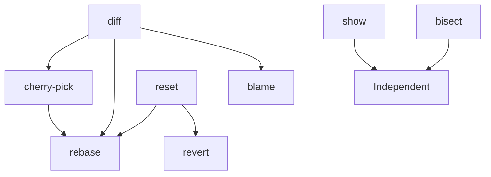

# Implementation Plan: Missing Git Operations

Generated: 2026-01-16

## Goal
Add critical missing Git operations to the Deno Git library to provide complete Git workflow support while maintaining zero npm dependencies and strict TypeScript safety.

## Executive Summary
This plan outlines the implementation of 8 critical and 11 nice-to-have Git operations across 5 development stages. Each stage delivers functional, tested operations that build upon previous work. The implementation follows the existing codebase patterns with the FileSystem abstraction and consistent API design.

## Existing Codebase Analysis

### Current Architecture
- **API Layer**: `/src/api/` - Public-facing functions with parameter validation
- **Commands Layer**: `/src/commands/` - Core implementation logic
- **Models**: `/src/models/` - Data structures (GitCommit, GitTree, etc.)
- **Managers**: `/src/managers/` - Git state management (GitRefManager, GitIndexManager)
- **Storage**: `/src/storage/` - Object reading/writing
- **Utils**: `/src/utils/` - Helper functions and adapters

### Key Patterns
1. **FileSystem Abstraction**: All file operations go through FileSystem model
2. **API Structure**: `{ dir, fs, gitdir, ...options } => Promise<result>`
3. **Error Handling**: Custom errors with caller tracking
4. **Parameter Validation**: assertParameter for required fields
5. **Testing**: Deno native test framework with simple assertions

## Implementation Phases

## Stage 1: Core Diff and Reset Operations
**Duration**: 3-4 days  
**Priority**: Critical - Foundation for other operations

### Operations to Implement

#### 1.1 diff - Show changes between commits/working tree
**Files to create:**
- `/src/api/diff.ts` - Public API
- `/src/commands/diff.ts` - Core diff logic
- `/src/utils/diff-algorithm.ts` - Myers diff algorithm
- `/src/models/git-diff.ts` - Diff result structure

**Implementation details:**
```typescript
export async function diff({
  fs,
  dir,
  gitdir,
  ref1 = "HEAD",
  ref2,
  filepath,
  cache = new Map()
}): Promise<DiffResult>
```

**Dependencies:**
- Requires: readCommit, readTree, readBlob
- Used by: status (enhancement), cherry-pick, rebase

#### 1.2 reset - Reset HEAD and optionally working tree
**Files to create:**
- `/src/api/reset.ts` - Public API (extends resetIndex)
- `/src/commands/reset.ts` - Reset modes implementation

**Implementation details:**
```typescript
export async function reset({
  fs,
  dir,
  gitdir,
  mode = "mixed", // soft, mixed, hard
  ref = "HEAD~1",
  cache = new Map()
}): Promise<void>
```

**Dependencies:**
- Requires: resetIndex, checkout, writeRef
- Used by: rebase, revert

### Tests Required
- `/tests/test-diff.ts` - Test file/commit diffs
- `/tests/test-reset.ts` - Test all reset modes

### Acceptance Criteria
- [ ] diff shows unified diff format output
- [ ] diff handles binary files appropriately
- [ ] reset supports soft/mixed/hard modes
- [ ] reset updates HEAD, index, and working tree correctly
- [ ] All tests pass

---

## Stage 2: Show and Blame Operations
**Duration**: 2-3 days  
**Priority**: High - Developer productivity features

### Operations to Implement

#### 2.1 show - Display git objects
**Files to create:**
- `/src/api/show.ts` - Public API
- `/src/commands/show.ts` - Object formatting

**Implementation details:**
```typescript
export async function show({
  fs,
  gitdir,
  oid,
  format = "raw", // raw, pretty, oneline
  cache = new Map()
}): Promise<string>
```

**Dependencies:**
- Requires: readObject, readCommit, readTree, readBlob
- Standalone operation

#### 2.2 blame - Show line authorship
**Files to create:**
- `/src/api/blame.ts` - Public API
- `/src/commands/blame.ts` - Blame algorithm
- `/src/models/git-blame.ts` - Blame result structure

**Implementation details:**
```typescript
export async function blame({
  fs,
  dir,
  gitdir,
  filepath,
  ref = "HEAD",
  cache = new Map()
}): Promise<BlameResult[]>
```

**Dependencies:**
- Requires: log, diff, readBlob
- Standalone operation

### Tests Required
- `/tests/test-show.ts` - Test object display
- `/tests/test-blame.ts` - Test line attribution

### Acceptance Criteria
- [ ] show displays commits, trees, blobs correctly
- [ ] show supports multiple output formats
- [ ] blame correctly attributes each line
- [ ] blame handles file renames
- [ ] All tests pass

---

## Stage 3: Cherry-pick and Revert Operations  
**Duration**: 3-4 days  
**Priority**: Critical - Essential workflow operations

### Operations to Implement

#### 3.1 cherry-pick - Apply specific commits
**Files to create:**
- `/src/api/cherry-pick.ts` - Public API
- `/src/commands/cherry-pick.ts` - Cherry-pick logic
- `/src/utils/apply-patch.ts` - Patch application utility

**Implementation details:**
```typescript
export async function cherryPick({
  fs,
  dir,
  gitdir,
  oid,
  noCommit = false,
  cache = new Map()
}): Promise<string>
```

**Dependencies:**
- Requires: diff, merge (3-way), commit
- Used by: rebase

#### 3.2 revert - Create reverse commits
**Files to create:**
- `/src/api/revert.ts` - Public API
- `/src/commands/revert.ts` - Revert logic

**Implementation details:**
```typescript
export async function revert({
  fs,
  dir,
  gitdir,
  oid,
  noCommit = false,
  cache = new Map()
}): Promise<string>
```

**Dependencies:**
- Requires: diff, reset, commit
- Standalone operation

### Tests Required
- `/tests/test-cherry-pick.ts` - Test commit application
- `/tests/test-revert.ts` - Test commit reversal

### Acceptance Criteria
- [ ] cherry-pick applies commits cleanly
- [ ] cherry-pick handles conflicts
- [ ] revert creates proper reverse commits
- [ ] revert handles merge commits
- [ ] All tests pass

---

## Stage 4: Rebase Operation
**Duration**: 4-5 days  
**Priority**: Critical - Complex but essential

### Operations to Implement

#### 4.1 rebase - Reapply commits on new base
**Files to create:**
- `/src/api/rebase.ts` - Public API
- `/src/commands/rebase.ts` - Rebase orchestration
- `/src/models/rebase-state.ts` - Rebase state management
- `/src/utils/rebase-todo.ts` - Todo list parser

**Implementation details:**
```typescript
export async function rebase({
  fs,
  dir,
  gitdir,
  onto,
  upstream,
  branch,
  interactive = false,
  onEdit, // For interactive mode
  cache = new Map()
}): Promise<RebaseResult>
```

**Dependencies:**
- Requires: cherry-pick, reset, merge, diff
- Most complex operation

### Tests Required
- `/tests/test-rebase.ts` - Test basic and interactive rebase
- `/tests/test-rebase-conflicts.ts` - Test conflict resolution

### Acceptance Criteria
- [ ] rebase performs linear rebasing
- [ ] rebase handles conflicts with markers
- [ ] rebase supports --continue/--abort
- [ ] Interactive mode works with todo editing
- [ ] All tests pass

---

## Stage 5: Bisect and Utility Operations
**Duration**: 3-4 days  
**Priority**: Medium - Useful but not critical

### Operations to Implement

#### 5.1 bisect - Binary search for bugs
**Files to create:**
- `/src/api/bisect.ts` - Public API
- `/src/commands/bisect.ts` - Bisect logic
- `/src/models/bisect-state.ts` - Bisect state

**Implementation details:**
```typescript
export async function bisect({
  fs,
  dir,
  gitdir,
  command, // start, good, bad, reset, run
  ref,
  cache = new Map()
}): Promise<BisectResult>
```

#### 5.2 reflog - Reference logs
**Files to create:**
- `/src/api/reflog.ts` - Public API
- `/src/commands/reflog.ts` - Reflog reading

#### 5.3 grep - Search in repository
**Files to create:**
- `/src/api/grep.ts` - Public API
- `/src/commands/grep.ts` - Search implementation

### Tests Required
- `/tests/test-bisect.ts` - Test binary search
- `/tests/test-reflog.ts` - Test reference logs
- `/tests/test-grep.ts` - Test repository search

### Acceptance Criteria
- [ ] bisect finds first bad commit
- [ ] reflog tracks reference changes
- [ ] grep searches across commits
- [ ] All tests pass

---

## Testing Strategy

### Unit Tests
- Each operation gets dedicated test file
- Test normal flow and edge cases
- Test error conditions

### Integration Tests
- Test operation combinations (e.g., rebase + cherry-pick)
- Test with real repository scenarios
- Performance benchmarks for large repos

### Test Data
- Use small synthetic repos for unit tests
- Use fixture repos for integration tests
- Test with binary files where applicable

## Dependencies and Prerequisites

### Technical Dependencies


### Required Utilities to Build
1. **Myers Diff Algorithm** - For diff operation
2. **3-way Merge** - Enhance existing merge
3. **Patch Application** - For cherry-pick
4. **Line Tracking** - For blame

## Risk Analysis

### Technical Risks
1. **Rebase Complexity** - Most complex operation
   - Mitigation: Incremental implementation, extensive testing
2. **Diff Performance** - Large files may be slow
   - Mitigation: Implement streaming, add size limits
3. **Conflict Resolution** - Complex merge scenarios
   - Mitigation: Clear conflict markers, good documentation

### Implementation Risks
1. **API Consistency** - Must match existing patterns
   - Mitigation: Review existing APIs thoroughly
2. **FileSystem Abstraction** - Must work with all FS implementations
   - Mitigation: Test with multiple FS backends

## Estimated Complexity

### Complexity Ratings (1-5 stars)
- **diff**: ⭐⭐⭐ - Algorithm complexity
- **reset**: ⭐⭐ - Builds on resetIndex
- **show**: ⭐ - Simple formatting
- **blame**: ⭐⭐⭐⭐ - Complex line tracking
- **cherry-pick**: ⭐⭐⭐ - Patch application
- **revert**: ⭐⭐ - Similar to cherry-pick
- **rebase**: ⭐⭐⭐⭐⭐ - Most complex
- **bisect**: ⭐⭐⭐ - State management

### Total Timeline
- **Stage 1**: 3-4 days
- **Stage 2**: 2-3 days  
- **Stage 3**: 3-4 days
- **Stage 4**: 4-5 days
- **Stage 5**: 3-4 days
- **Total**: 15-20 days

## Success Metrics

1. **Functionality**: All operations work as specified
2. **Performance**: Operations complete in reasonable time
3. **Compatibility**: Works with existing Git repositories
4. **Test Coverage**: >90% code coverage
5. **Documentation**: Complete API documentation
6. **Type Safety**: Full TypeScript support

## Next Steps

1. Review and approve implementation plan
2. Set up development environment
3. Begin Stage 1 implementation
4. Create progress tracking system
5. Schedule regular code reviews

## Notes

- Follow existing code patterns religiously
- Maintain zero npm dependencies
- Ensure all operations work with FileSystem abstraction
- Add comprehensive JSDoc comments
- Update main index.ts exports for each operation
- Consider performance from the start
- Plan for streaming large operations